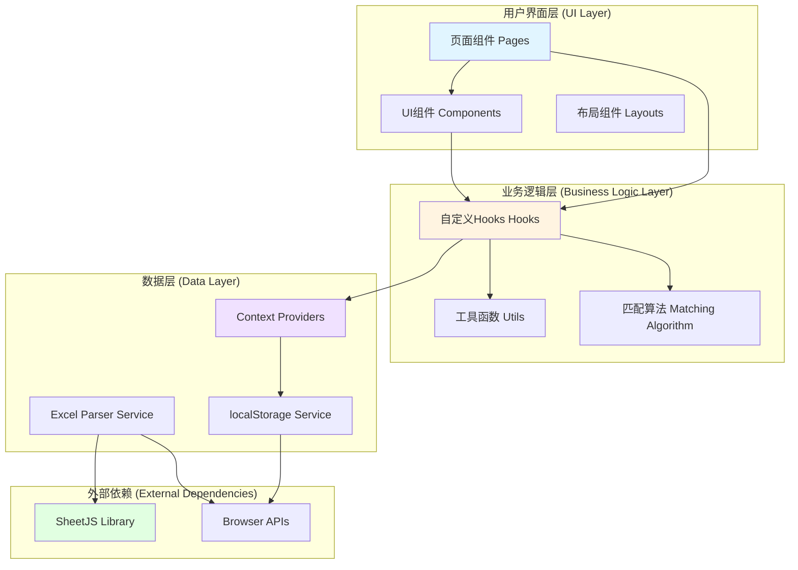
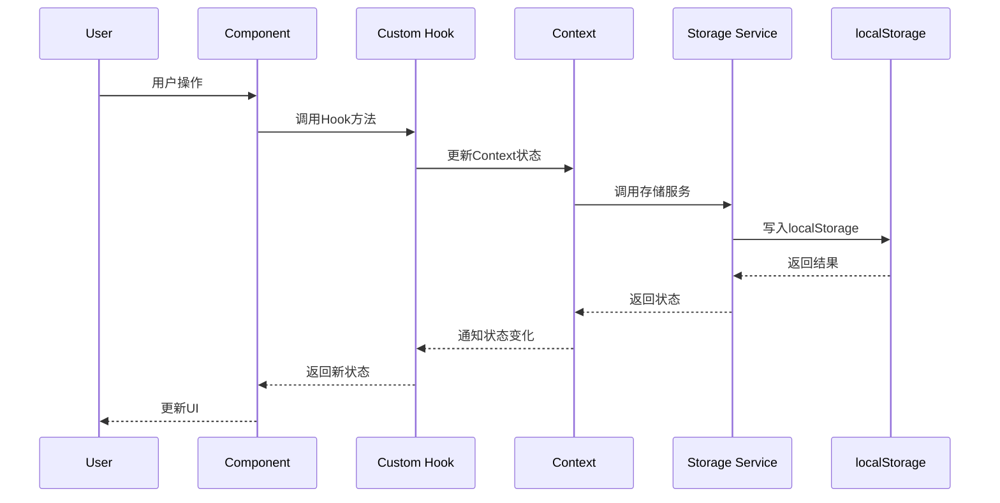
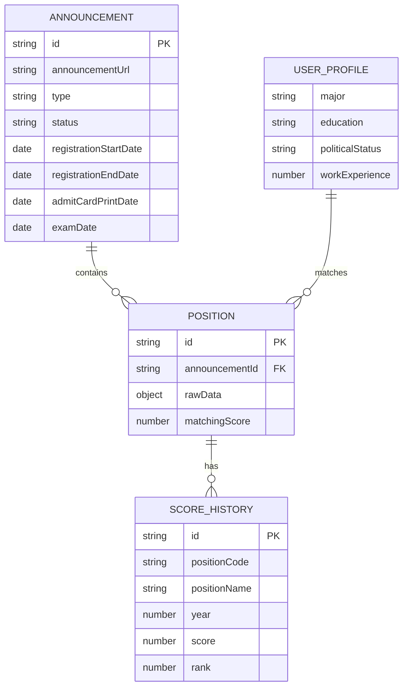

# 设计文档

## 概述

公务员考试岗位分析系统是一个纯前端的单页应用（SPA），采用现代化的React技术栈构建。系统的核心功能包括考试公告管理、Excel岗位数据解析、智能岗位匹配推荐、多维度筛选和数据导出。所有数据通过浏览器localStorage进行本地持久化，无需后端服务器支持，可直接部署到静态网站托管平台。

### 技术栈

- **前端框架**: React 18+ with TypeScript
- **构建工具**: Vite 5+
- **路由管理**: React Router v6
- **UI框架**: Tailwind CSS 3+
- **Excel处理**: SheetJS (xlsx) library
- **状态管理**: React Context API + Custom Hooks
- **数据持久化**: Browser localStorage API
- **日期处理**: date-fns library
- **部署平台**: GitHub Pages / Cloudflare Pages

### 设计原则

1. **纯前端架构**: 所有业务逻辑在客户端执行，无后端依赖
2. **响应式设计**: 支持桌面、平板和移动设备
3. **数据本地化**: 使用localStorage实现数据持久化
4. **性能优化**: 虚拟滚动、懒加载、防抖节流
5. **用户体验**: 即时反馈、加载状态、错误提示

## 架构

### 系统架构图



### 目录结构

```
src/
├── components/          # 可复用UI组件
│   ├── common/         # 通用组件（Button, Input, Modal等）
│   ├── announcement/   # 公告相关组件
│   ├── position/       # 岗位相关组件
│   └── filter/         # 筛选相关组件
├── pages/              # 页面组件
│   ├── Home.tsx
│   ├── AnnouncementList.tsx
│   ├── AnnouncementDetail.tsx
│   ├── PositionList.tsx
│   ├── PositionDetail.tsx
│   └── UserProfile.tsx
├── hooks/              # 自定义Hooks
│   ├── useLocalStorage.ts
│   ├── useAnnouncements.ts
│   ├── usePositions.ts
│   ├── useUserProfile.ts
│   └── useMatchingScore.ts
├── contexts/           # React Context
│   ├── AnnouncementContext.tsx
│   ├── PositionContext.tsx
│   └── UserProfileContext.tsx
├── services/           # 业务服务
│   ├── storageService.ts
│   ├── excelService.ts
│   └── matchingService.ts
├── utils/              # 工具函数
│   ├── validation.ts
│   ├── dateUtils.ts
│   └── formatters.ts
├── types/              # TypeScript类型定义
│   ├── announcement.ts
│   ├── position.ts
│   └── user.ts
├── constants/          # 常量定义
│   └── index.ts
├── App.tsx
└── main.tsx
```

### 数据流架构



## 组件和接口

### 核心组件

#### 1. 公告管理组件

**AnnouncementForm**
- 功能：创建和编辑考试公告
- Props:
  ```typescript
  interface AnnouncementFormProps {
    initialData?: Announcement;
    onSubmit: (data: Announcement) => void;
    onCancel: () => void;
  }
  ```
- 职责：表单验证、数据提交、错误处理

**AnnouncementCard**
- 功能：展示公告摘要信息
- Props:
  ```typescript
  interface AnnouncementCardProps {
    announcement: Announcement;
    onClick: (id: string) => void;
  }
  ```
- 职责：显示公告状态、时间信息、跳转详情

**AnnouncementStatusBadge**
- 功能：显示公告状态标签
- Props:
  ```typescript
  interface AnnouncementStatusBadgeProps {
    status: AnnouncementStatus;
  }
  ```
- 职责：根据状态显示不同颜色和文本

#### 2. 岗位管理组件

**PositionTable**
- 功能：以表格形式展示岗位列表
- Props:
  ```typescript
  interface PositionTableProps {
    positions: Position[];
    columns: TableColumn[];
    onSort: (column: string, direction: 'asc' | 'desc') => void;
    onRowClick: (position: Position) => void;
  }
  ```
- 职责：表格渲染、排序、分页、虚拟滚动

**PositionCard**
- 功能：以卡片形式展示单个岗位
- Props:
  ```typescript
  interface PositionCardProps {
    position: Position;
    matchingScore?: number;
    onViewDetail: (id: string) => void;
  }
  ```
- 职责：显示岗位关键信息、匹配度、操作按钮

**PositionFilter**
- 功能：岗位筛选面板
- Props:
  ```typescript
  interface PositionFilterProps {
    filterOptions: FilterOption[];
    selectedFilters: Record<string, string[]>;
    onFilterChange: (filters: Record<string, string[]>) => void;
  }
  ```
- 职责：动态生成筛选项、多选支持、实时筛选

**PositionStats**
- 功能：岗位统计信息展示
- Props:
  ```typescript
  interface PositionStatsProps {
    totalPositions: number;
    totalRecruits: number;
    eligiblePositions: number;
  }
  ```
- 职责：统计数据计算和展示

#### 3. Excel处理组件

**ExcelUploader**
- 功能：Excel文件上传和解析
- Props:
  ```typescript
  interface ExcelUploaderProps {
    onUploadSuccess: (data: ParsedExcelData) => void;
    onUploadError: (error: Error) => void;
    maxSize?: number; // MB
  }
  ```
- 职责：文件验证、解析、进度显示

#### 4. 用户信息组件

**UserProfileForm**
- 功能：用户个人信息表单
- Props:
  ```typescript
  interface UserProfileFormProps {
    initialData?: UserProfile;
    onSubmit: (data: UserProfile) => void;
  }
  ```
- 职责：表单验证、数据提交

**MatchingScoreIndicator**
- 功能：匹配度可视化指示器
- Props:
  ```typescript
  interface MatchingScoreIndicatorProps {
    score: number; // 0-100
    size?: 'small' | 'medium' | 'large';
  }
  ```
- 职责：进度条或星级显示

#### 5. 通用组件

**Button, Input, Select, Modal, Toast, Loading, ErrorBoundary**

### 接口定义

#### Context接口

**AnnouncementContext**
```typescript
interface AnnouncementContextValue {
  announcements: Announcement[];
  loading: boolean;
  error: Error | null;
  createAnnouncement: (data: AnnouncementInput) => Promise<void>;
  updateAnnouncement: (id: string, data: Partial<Announcement>) => Promise<void>;
  deleteAnnouncement: (id: string) => Promise<void>;
  getAnnouncementById: (id: string) => Announcement | undefined;
}
```

**PositionContext**
```typescript
interface PositionContextValue {
  positions: Position[];
  filteredPositions: Position[];
  filterOptions: FilterOption[];
  selectedFilters: Record<string, string[]>;
  loading: boolean;
  error: Error | null;
  uploadPositions: (announcementId: string, file: File) => Promise<void>;
  setFilters: (filters: Record<string, string[]>) => void;
  clearFilters: () => void;
  getPositionById: (id: string) => Position | undefined;
}
```

**UserProfileContext**
```typescript
interface UserProfileContextValue {
  profile: UserProfile | null;
  loading: boolean;
  error: Error | null;
  updateProfile: (data: UserProfile) => Promise<void>;
  clearProfile: () => void;
}
```

#### Service接口

**StorageService**
```typescript
interface StorageService {
  save<T>(key: string, data: T): void;
  load<T>(key: string): T | null;
  remove(key: string): void;
  clear(): void;
  exportData(): string; // JSON string
  importData(jsonString: string): void;
}
```

**ExcelService**
```typescript
interface ExcelService {
  parseFile(file: File): Promise<ParsedExcelData>;
  exportToExcel(data: Position[], filename: string): void;
  validateFile(file: File): ValidationResult;
}

interface ParsedExcelData {
  headers: string[];
  rows: Record<string, any>[];
}
```

**MatchingService**
```typescript
interface MatchingService {
  calculateScore(position: Position, profile: UserProfile): number;
  sortByMatchingScore(positions: Position[], profile: UserProfile): Position[];
  getMatchingDetails(position: Position, profile: UserProfile): MatchingDetails;
}

interface MatchingDetails {
  totalScore: number;
  majorScore: number;
  educationScore: number;
  politicalStatusScore: number;
  workExperienceScore: number;
}
```

## 数据模型

### 核心数据类型

#### Announcement（考试公告）

```typescript
interface Announcement {
  id: string;                    // UUID
  announcementUrl: string;       // 公告链接
  type: string;                  // 考试类型（公务员/事业编）
  status: AnnouncementStatus;    // 进行状态
  registrationStartDate: Date;   // 报名时间
  registrationEndDate: Date;     // 截至时间
  admitCardPrintDate: Date;      // 打印准考证时间
  examDate: Date;                // 考试时间
  createdAt: Date;               // 创建时间
  updatedAt: Date;               // 更新时间
}

type AnnouncementStatus = 
  | 'NOT_STARTED'           // 未开始
  | 'REGISTRATION_OPEN'     // 报名中
  | 'REGISTRATION_CLOSED'   // 报名结束
  | 'ADMIT_CARD_AVAILABLE'  // 准考证打印中
  | 'EXAM_IN_PROGRESS'      // 考试进行中
  | 'COMPLETED';            // 已结束
```

#### Position（岗位）

```typescript
interface Position {
  id: string;                           // UUID
  announcementId: string;               // 关联的公告ID
  rawData: Record<string, any>;         // 原始Excel数据
  matchingScore?: number;               // 匹配度分数（0-100）
  createdAt: Date;
}

// 动态字段通过rawData访问，例如：
// position.rawData['岗位代码']
// position.rawData['招聘人数']
// position.rawData['专业要求']
```

#### UserProfile（用户信息）

```typescript
interface UserProfile {
  major: string;                        // 专业（必填）
  education: EducationLevel;            // 学历（必填）
  politicalStatus?: string;             // 政治面貌（可选）
  workExperience?: number;              // 工作年限（可选，0-50）
  updatedAt: Date;
}

type EducationLevel = 
  | 'ASSOCIATE'    // 专科
  | 'BACHELOR'     // 本科
  | 'MASTER'       // 硕士
  | 'DOCTORATE';   // 博士
```

#### FilterOption（筛选选项）

```typescript
interface FilterOption {
  field: string;                        // 字段名（表头）
  label: string;                        // 显示标签
  values: FilterValue[];                // 可选值列表
}

interface FilterValue {
  value: string;                        // 实际值
  label: string;                        // 显示标签
  count: number;                        // 该值的岗位数量
}
```

#### ScoreHistory（历年分数）

```typescript
interface ScoreHistory {
  id: string;
  positionCode: string;                 // 岗位代码
  positionName: string;                 // 岗位名称
  year: number;                         // 年份
  score: number;                        // 录取分数
  rank?: number;                        // 排名
}
```

### 数据存储结构

localStorage中的数据结构：

```typescript
// Key: 'announcements'
type AnnouncementsStorage = Announcement[];

// Key: 'positions'
type PositionsStorage = Position[];

// Key: 'userProfile'
type UserProfileStorage = UserProfile;

// Key: 'scoreHistory'
type ScoreHistoryStorage = ScoreHistory[];
```

### 数据关系图




## 核心算法

### 1. 岗位匹配度计算算法

匹配度计算是系统的核心功能，根据用户个人信息与岗位要求的匹配程度计算0-100分的匹配分数。

#### 算法逻辑

```typescript
function calculateMatchingScore(
  position: Position, 
  profile: UserProfile
): number {
  let totalScore = 0;
  
  // 1. 专业匹配（权重60分）
  const majorScore = calculateMajorMatch(
    position.rawData['专业要求'] || position.rawData['专业'],
    profile.major
  );
  totalScore += majorScore;
  
  // 2. 学历匹配（权重20分）
  const educationScore = calculateEducationMatch(
    position.rawData['学历要求'] || position.rawData['学历'],
    profile.education
  );
  totalScore += educationScore;
  
  // 3. 政治面貌匹配（权重10分）
  if (profile.politicalStatus) {
    const politicalScore = calculatePoliticalMatch(
      position.rawData['政治面貌'] || position.rawData['政治面貌要求'],
      profile.politicalStatus
    );
    totalScore += politicalScore;
  }
  
  // 4. 工作年限匹配（权重10分）
  if (profile.workExperience !== undefined) {
    const experienceScore = calculateExperienceMatch(
      position.rawData['工作年限'] || position.rawData['工作经验'],
      profile.workExperience
    );
    totalScore += experienceScore;
  }
  
  return totalScore;
}
```

#### 专业匹配算法

```typescript
function calculateMajorMatch(
  positionMajor: string | undefined,
  userMajor: string
): number {
  if (!positionMajor || !userMajor) return 0;
  
  const normalizedPositionMajor = positionMajor.trim().toLowerCase();
  const normalizedUserMajor = userMajor.trim().toLowerCase();
  
  // 完全匹配：60分
  if (normalizedPositionMajor === normalizedUserMajor) {
    return 60;
  }
  
  // 部分匹配（包含关系）：30分
  if (normalizedPositionMajor.includes(normalizedUserMajor) || 
      normalizedUserMajor.includes(normalizedPositionMajor)) {
    return 30;
  }
  
  // 不匹配：0分
  return 0;
}
```

#### 学历匹配算法

```typescript
function calculateEducationMatch(
  positionEducation: string | undefined,
  userEducation: EducationLevel
): number {
  if (!positionEducation) return 0;
  
  const educationLevels: Record<EducationLevel, number> = {
    'ASSOCIATE': 1,
    'BACHELOR': 2,
    'MASTER': 3,
    'DOCTORATE': 4
  };
  
  const normalizedPositionEdu = normalizeEducation(positionEducation);
  if (!normalizedPositionEdu) return 0;
  
  // 完全匹配：20分
  if (normalizedPositionEdu === userEducation) {
    return 20;
  }
  
  // 用户学历高于要求：也算匹配，给20分
  if (educationLevels[userEducation] > educationLevels[normalizedPositionEdu]) {
    return 20;
  }
  
  // 不匹配：0分
  return 0;
}

function normalizeEducation(education: string): EducationLevel | null {
  const eduMap: Record<string, EducationLevel> = {
    '专科': 'ASSOCIATE',
    '大专': 'ASSOCIATE',
    '本科': 'BACHELOR',
    '学士': 'BACHELOR',
    '硕士': 'MASTER',
    '研究生': 'MASTER',
    '博士': 'DOCTORATE'
  };
  
  for (const [key, value] of Object.entries(eduMap)) {
    if (education.includes(key)) {
      return value;
    }
  }
  
  return null;
}
```

#### 政治面貌匹配算法

```typescript
function calculatePoliticalMatch(
  positionPolitical: string | undefined,
  userPolitical: string
): number {
  if (!positionPolitical || !userPolitical) return 0;
  
  const normalized1 = positionPolitical.trim().toLowerCase();
  const normalized2 = userPolitical.trim().toLowerCase();
  
  // 完全匹配：10分
  if (normalized1 === normalized2) {
    return 10;
  }
  
  // 不匹配：0分
  return 0;
}
```

#### 工作年限匹配算法

```typescript
function calculateExperienceMatch(
  positionExperience: string | number | undefined,
  userExperience: number
): number {
  if (positionExperience === undefined) return 0;
  
  // 提取数字（处理"3年"、"3年以上"等格式）
  const requiredYears = extractYears(positionExperience);
  if (requiredYears === null) return 0;
  
  // 用户工作年限 >= 要求年限：10分
  if (userExperience >= requiredYears) {
    return 10;
  }
  
  // 不满足：0分
  return 0;
}

function extractYears(value: string | number): number | null {
  if (typeof value === 'number') return value;
  
  const match = value.match(/(\d+)/);
  return match ? parseInt(match[1], 10) : null;
}
```

### 2. 筛选算法

多维度筛选算法支持用户同时选择多个筛选条件，返回满足所有条件的岗位。

```typescript
function filterPositions(
  positions: Position[],
  filters: Record<string, string[]>
): Position[] {
  return positions.filter(position => {
    // 遍历所有筛选条件
    for (const [field, selectedValues] of Object.entries(filters)) {
      // 如果该字段没有选择任何值，跳过
      if (selectedValues.length === 0) continue;
      
      // 获取岗位在该字段的值
      const positionValue = position.rawData[field];
      
      // 如果岗位值为空，不匹配
      if (!positionValue) return false;
      
      // 检查岗位值是否在选中的值列表中
      const normalizedPositionValue = String(positionValue).trim();
      const isMatch = selectedValues.some(selectedValue => 
        normalizedPositionValue === selectedValue.trim()
      );
      
      // 如果不匹配任何选中值，过滤掉该岗位
      if (!isMatch) return false;
    }
    
    // 通过所有筛选条件
    return true;
  });
}
```

### 3. 排序算法

支持按任意列进行升序或降序排序。

```typescript
function sortPositions(
  positions: Position[],
  sortColumn: string,
  sortDirection: 'asc' | 'desc'
): Position[] {
  return [...positions].sort((a, b) => {
    const aValue = a.rawData[sortColumn];
    const bValue = b.rawData[sortColumn];
    
    // 处理空值
    if (aValue === undefined || aValue === null) return 1;
    if (bValue === undefined || bValue === null) return -1;
    
    // 数字比较
    if (typeof aValue === 'number' && typeof bValue === 'number') {
      return sortDirection === 'asc' ? aValue - bValue : bValue - aValue;
    }
    
    // 字符串比较
    const aStr = String(aValue);
    const bStr = String(bValue);
    const comparison = aStr.localeCompare(bStr, 'zh-CN');
    
    return sortDirection === 'asc' ? comparison : -comparison;
  });
}
```

### 4. 公告状态自动更新算法

根据当前日期自动计算公告状态。

```typescript
function calculateAnnouncementStatus(announcement: Announcement): AnnouncementStatus {
  const now = new Date();
  const registrationStart = new Date(announcement.registrationStartDate);
  const registrationEnd = new Date(announcement.registrationEndDate);
  const admitCardPrint = new Date(announcement.admitCardPrintDate);
  const examDate = new Date(announcement.examDate);
  
  // 考试已结束
  if (now > examDate) {
    return 'COMPLETED';
  }
  
  // 考试进行中（考试当天）
  if (isSameDay(now, examDate)) {
    return 'EXAM_IN_PROGRESS';
  }
  
  // 准考证打印中
  if (now >= admitCardPrint && now < examDate) {
    return 'ADMIT_CARD_AVAILABLE';
  }
  
  // 报名结束
  if (now > registrationEnd && now < admitCardPrint) {
    return 'REGISTRATION_CLOSED';
  }
  
  // 报名中
  if (now >= registrationStart && now <= registrationEnd) {
    return 'REGISTRATION_OPEN';
  }
  
  // 未开始
  return 'NOT_STARTED';
}

function isSameDay(date1: Date, date2: Date): boolean {
  return date1.getFullYear() === date2.getFullYear() &&
         date1.getMonth() === date2.getMonth() &&
         date1.getDate() === date2.getDate();
}
```

### 5. 统计算法

计算岗位统计信息。

```typescript
function calculatePositionStats(
  positions: Position[],
  profile: UserProfile | null
): PositionStats {
  // 岗位总数
  const totalPositions = positions.length;
  
  // 招聘总人数
  const totalRecruits = positions.reduce((sum, position) => {
    const recruits = position.rawData['招聘人数'] || 
                     position.rawData['招录人数'] || 
                     position.rawData['人数'];
    const num = typeof recruits === 'number' ? recruits : parseInt(recruits) || 0;
    return sum + num;
  }, 0);
  
  // 可报考岗位数量（需要用户信息）
  let eligiblePositions = 0;
  if (profile) {
    eligiblePositions = positions.filter(position => {
      const score = calculateMatchingScore(position, profile);
      // 匹配度 >= 60分视为可报考
      return score >= 60;
    }).length;
  }
  
  return {
    totalPositions,
    totalRecruits,
    eligiblePositions: profile ? eligiblePositions : null
  };
}
```

## 路由设计

### 路由表

```typescript
const routes = [
  {
    path: '/',
    element: <Home />,
    name: '首页'
  },
  {
    path: '/announcements',
    element: <AnnouncementList />,
    name: '公告列表'
  },
  {
    path: '/announcements/new',
    element: <AnnouncementForm />,
    name: '创建公告'
  },
  {
    path: '/announcements/:id',
    element: <AnnouncementDetail />,
    name: '公告详情'
  },
  {
    path: '/announcements/:id/edit',
    element: <AnnouncementForm />,
    name: '编辑公告'
  },
  {
    path: '/announcements/:announcementId/positions',
    element: <PositionList />,
    name: '岗位列表'
  },
  {
    path: '/announcements/:announcementId/positions/:positionId',
    element: <PositionDetail />,
    name: '岗位详情'
  },
  {
    path: '/profile',
    element: <UserProfile />,
    name: '个人信息'
  },
  {
    path: '/export',
    element: <DataExport />,
    name: '数据导出'
  },
  {
    path: '*',
    element: <NotFound />,
    name: '404'
  }
];
```

### 路由结构图

```mermaid
graph TD
    A[/ 首页] --> B[/announcements 公告列表]
    B --> C[/announcements/new 创建公告]
    B --> D[/announcements/:id 公告详情]
    D --> E[/announcements/:id/edit 编辑公告]
    D --> F[/announcements/:announcementId/positions 岗位列表]
    F --> G[/announcements/:announcementId/positions/:positionId 岗位详情]
    A --> H[/profile 个人信息]
    A --> I[/export 数据导出]
```

### 导航结构

**主导航栏**
- 首页
- 公告管理
- 个人信息
- 数据导出

**面包屑导航示例**
- 首页 > 公告列表 > 公告详情 > 岗位列表 > 岗位详情

## 存储方案

### localStorage存储策略

#### 存储键设计

```typescript
const STORAGE_KEYS = {
  ANNOUNCEMENTS: 'civil_service_announcements',
  POSITIONS: 'civil_service_positions',
  USER_PROFILE: 'civil_service_user_profile',
  SCORE_HISTORY: 'civil_service_score_history',
  APP_VERSION: 'civil_service_app_version'
} as const;
```

#### 数据版本控制

为了支持未来的数据结构升级，实现版本控制机制：

```typescript
interface StorageData<T> {
  version: string;
  data: T;
  timestamp: number;
}

function saveWithVersion<T>(key: string, data: T): void {
  const storageData: StorageData<T> = {
    version: APP_VERSION,
    data,
    timestamp: Date.now()
  };
  localStorage.setItem(key, JSON.stringify(storageData));
}

function loadWithVersion<T>(key: string): T | null {
  const item = localStorage.getItem(key);
  if (!item) return null;
  
  try {
    const storageData: StorageData<T> = JSON.parse(item);
    
    // 版本检查和迁移
    if (storageData.version !== APP_VERSION) {
      return migrateData(storageData);
    }
    
    return storageData.data;
  } catch (error) {
    console.error('Failed to load data:', error);
    return null;
  }
}
```

#### 存储容量管理

localStorage通常有5-10MB的限制，需要实现容量监控：

```typescript
function getStorageSize(): number {
  let total = 0;
  for (const key in localStorage) {
    if (localStorage.hasOwnProperty(key)) {
      total += localStorage[key].length + key.length;
    }
  }
  return total;
}

function getStorageSizeInMB(): number {
  return getStorageSize() / (1024 * 1024);
}

function checkStorageQuota(): boolean {
  const sizeInMB = getStorageSizeInMB();
  const QUOTA_WARNING_THRESHOLD = 4; // MB
  
  if (sizeInMB > QUOTA_WARNING_THRESHOLD) {
    console.warn(`Storage usage: ${sizeInMB.toFixed(2)}MB`);
    return false;
  }
  
  return true;
}
```

#### 错误处理

```typescript
function safeStorageOperation<T>(
  operation: () => T,
  fallback: T
): T {
  try {
    return operation();
  } catch (error) {
    if (error instanceof DOMException && error.name === 'QuotaExceededError') {
      console.error('Storage quota exceeded');
      // 触发清理或提示用户
      handleStorageQuotaExceeded();
    } else {
      console.error('Storage operation failed:', error);
    }
    return fallback;
  }
}
```

### 数据导入导出

#### 导出功能

```typescript
function exportAllData(): string {
  const exportData = {
    version: APP_VERSION,
    exportDate: new Date().toISOString(),
    announcements: loadFromStorage(STORAGE_KEYS.ANNOUNCEMENTS),
    positions: loadFromStorage(STORAGE_KEYS.POSITIONS),
    userProfile: loadFromStorage(STORAGE_KEYS.USER_PROFILE),
    scoreHistory: loadFromStorage(STORAGE_KEYS.SCORE_HISTORY)
  };
  
  return JSON.stringify(exportData, null, 2);
}

function downloadExportFile(): void {
  const data = exportAllData();
  const blob = new Blob([data], { type: 'application/json' });
  const url = URL.createObjectURL(blob);
  const filename = `岗位数据备份_${formatDate(new Date(), 'YYYY-MM-DD')}.json`;
  
  const link = document.createElement('a');
  link.href = url;
  link.download = filename;
  link.click();
  
  URL.revokeObjectURL(url);
}
```

#### 导入功能

```typescript
function importData(jsonString: string): void {
  try {
    const importData = JSON.parse(jsonString);
    
    // 验证数据结构
    if (!validateImportData(importData)) {
      throw new Error('Invalid data format');
    }
    
    // 导入数据
    if (importData.announcements) {
      saveToStorage(STORAGE_KEYS.ANNOUNCEMENTS, importData.announcements);
    }
    if (importData.positions) {
      saveToStorage(STORAGE_KEYS.POSITIONS, importData.positions);
    }
    if (importData.userProfile) {
      saveToStorage(STORAGE_KEYS.USER_PROFILE, importData.userProfile);
    }
    if (importData.scoreHistory) {
      saveToStorage(STORAGE_KEYS.SCORE_HISTORY, importData.scoreHistory);
    }
    
    console.log('Data imported successfully');
  } catch (error) {
    console.error('Failed to import data:', error);
    throw error;
  }
}
```

### Excel文件处理

#### 文件解析

使用SheetJS库解析Excel文件：

```typescript
import * as XLSX from 'xlsx';

async function parseExcelFile(file: File): Promise<ParsedExcelData> {
  return new Promise((resolve, reject) => {
    const reader = new FileReader();
    
    reader.onload = (e) => {
      try {
        const data = e.target?.result;
        const workbook = XLSX.read(data, { type: 'binary' });
        
        // 读取第一个工作表
        const firstSheetName = workbook.SheetNames[0];
        const worksheet = workbook.Sheets[firstSheetName];
        
        // 转换为JSON
        const jsonData = XLSX.utils.sheet_to_json(worksheet, { 
          header: 1,
          defval: '',
          raw: false // 保持原始格式
        });
        
        if (jsonData.length === 0) {
          reject(new Error('Excel文件为空'));
          return;
        }
        
        // 第一行为表头
        const headers = jsonData[0] as string[];
        
        // 后续行为数据
        const rows = jsonData.slice(1).map((row: any[]) => {
          const rowData: Record<string, any> = {};
          headers.forEach((header, index) => {
            rowData[header] = row[index] || '';
          });
          return rowData;
        }).filter(row => {
          // 过滤空行
          return Object.values(row).some(value => value !== '');
        });
        
        resolve({ headers, rows });
      } catch (error) {
        reject(error);
      }
    };
    
    reader.onerror = () => {
      reject(new Error('文件读取失败'));
    };
    
    reader.readAsBinaryString(file);
  });
}
```

#### 文件导出

```typescript
function exportPositionsToExcel(
  positions: Position[],
  filename: string
): void {
  if (positions.length === 0) return;
  
  // 获取所有字段
  const headers = Object.keys(positions[0].rawData);
  
  // 添加匹配度列
  if (positions[0].matchingScore !== undefined) {
    headers.push('匹配度');
  }
  
  // 构建数据数组
  const data = [
    headers,
    ...positions.map(position => {
      const row = headers.map(header => {
        if (header === '匹配度') {
          return position.matchingScore || 0;
        }
        return position.rawData[header] || '';
      });
      return row;
    })
  ];
  
  // 创建工作表
  const worksheet = XLSX.utils.aoa_to_sheet(data);
  
  // 创建工作簿
  const workbook = XLSX.utils.book_new();
  XLSX.utils.book_append_sheet(workbook, worksheet, '岗位数据');
  
  // 导出文件
  XLSX.writeFile(workbook, filename);
}
```


## 正确性属性

*属性是一个特征或行为，应该在系统的所有有效执行中保持为真——本质上是关于系统应该做什么的形式化陈述。属性作为人类可读规范和机器可验证正确性保证之间的桥梁。*

### 属性反思

在分析了所有验收标准后，我识别出以下可以通过属性测试验证的核心属性。通过反思，我合并了一些逻辑上相关的属性以避免冗余：

**合并的属性：**
1. 表单验证属性（1.2-1.5）可以合并为一个综合的表单验证属性
2. 文件验证属性（2.2-2.3, 11.1-11.2）可以合并为文件验证属性
3. 数据持久化属性（1.7, 4.1, 8.4-8.6, 8.8）都是round-trip测试，可以合并为统一的数据持久化属性
4. Excel解析属性（2.7, 11.3-11.6）可以合并为Excel解析round-trip属性
5. 筛选和统计属性（3.3, 3.5, 3.7, 5.2, 5.3, 5.5, 5.8）涉及数据过滤和聚合，可以合并为筛选和统计属性
6. 排序属性（4.5, 12.7）可以合并为通用排序属性
7. 匹配度计算属性（14.1-14.13）是单一算法的不同方面，合并为匹配度计算属性
8. 导出属性（8.10, 15.2, 15.5-15.6）可以合并为数据导出round-trip属性

### 属性 1: 表单输入验证

*对于任意* 公告表单输入数据，验证函数应该正确识别无效输入（空字段、纯空白字符、无效URL格式、无效日期格式、时间顺序错误），并且只接受所有字段都有效的表单数据。

**验证需求: 1.2, 1.3, 1.4, 1.5**

### 属性 2: 文件上传验证

*对于任意* 文件元数据（文件名、文件大小），文件验证函数应该正确识别无效文件（错误的扩展名、超过大小限制、空文件），并且只接受扩展名为.xlsx或.xls且大小在0到10MB之间的文件。

**验证需求: 2.2, 2.3, 11.1, 11.2**

### 属性 3: 数据持久化Round-Trip

*对于任意* 有效的系统数据（公告、岗位、用户信息），保存到localStorage后立即读取应该得到与原始数据等价的数据（数据结构、字段值、数据类型都保持一致）。

**验证需求: 1.7, 4.1, 8.4, 8.5, 8.6, 8.8, 13.11**

### 属性 4: Excel解析Round-Trip

*对于任意* 有效的Excel数据结构（表头和数据行），解析后应该正确提取表头列表和数据行列表，并且保留所有单元格的原始数据类型（文本、数字、日期）。

**验证需求: 2.7, 11.3, 11.4, 11.5, 11.6**

### 属性 5: 表头识别和筛选选项生成

*对于任意* Excel数据，第一行应该被识别为表头，并且为每个非空列生成对应的筛选选项，筛选选项的数量应该等于非空列的数量。

**验证需求: 3.1, 3.2**

### 属性 6: 唯一值提取和计数

*对于任意* 数据列，提取唯一值函数应该返回去重后的值列表，并且每个唯一值的计数应该等于该值在原始数据中出现的次数。

**验证需求: 3.3, 3.7**

### 属性 7: 多维度筛选

*对于任意* 岗位数据集和筛选条件组合，筛选函数应该返回满足所有选中筛选条件的岗位子集，并且筛选结果中的每个岗位在每个筛选字段上的值都应该在该字段的选中值列表中。

**验证需求: 3.5**

### 属性 8: 统计计算

*对于任意* 岗位数据集，统计函数应该正确计算：
- 岗位总数等于数据集的长度
- 招聘总人数等于所有岗位招聘人数字段的数值总和（缺失或非数值视为0）
- 可报考岗位数量等于匹配度>=60分的岗位数量（当用户信息存在时）

**验证需求: 5.2, 5.3, 5.4, 5.5**

### 属性 9: 筛选后统计一致性

*对于任意* 岗位数据集和筛选条件，应用筛选后的统计信息应该基于筛选后的数据子集计算，而不是原始完整数据集。

**验证需求: 5.8**

### 属性 10: 排序正确性

*对于任意* 数据列和排序方向（升序或降序），排序函数应该返回正确排序的数据列表，其中：
- 升序时，对于任意相邻元素对(a, b)，a <= b
- 降序时，对于任意相邻元素对(a, b)，a >= b
- 空值应该排在末尾

**验证需求: 4.5, 12.7**

### 属性 11: 公告状态自动计算

*对于任意* 公告的时间信息（报名时间、截至时间、准考证打印时间、考试时间）和当前日期，状态计算函数应该根据日期比较逻辑返回正确的状态（未开始、报名中、报名结束、准考证打印中、考试进行中、已结束）。

**验证需求: 7.3, 7.4, 7.5, 7.6, 7.7, 7.8, 7.9**

### 属性 12: 岗位匹配度计算

*对于任意* 岗位要求和用户信息，匹配度计算函数应该返回0-100之间的分数，其中：
- 专业完全匹配得60分，部分匹配得30分，不匹配得0分
- 学历匹配或高于要求得20分，不匹配得0分
- 政治面貌匹配得10分，不匹配得0分
- 工作年限满足要求得10分，不满足得0分
- 总分 = 各项分数之和
- 缺失字段的匹配分为0

**验证需求: 14.1, 14.2, 14.3, 14.4, 14.5, 14.6, 14.7, 14.8, 14.9, 14.10, 14.11, 14.12, 14.13**

### 属性 13: 日期格式化

*对于任意* 日期类型的数据或包含日期关键字的字段，格式化函数应该将其转换为YYYY-MM-DD格式的字符串。

**验证需求: 12.2, 12.3**

### 属性 14: 数字字段识别

*对于任意* 数字类型的数据或包含数字关键字的字段，识别函数应该正确将其标记为数字字段。

**验证需求: 12.4, 12.5**

### 属性 15: 长文本截断

*对于任意* 文本字符串，如果长度超过50个字符，截断函数应该返回前50个字符加省略号，否则返回原始字符串。

**验证需求: 12.6**

### 属性 16: 数据导出Round-Trip

*对于任意* 岗位数据集（包括匹配度），导出为Excel后再解析应该得到包含所有原始列、匹配度列和相同数据值的数据结构。

**验证需求: 8.10, 15.2, 15.5, 15.6**

### 属性 17: 文件名生成

*对于任意* 日期，文件名生成函数应该返回格式为"前缀_YYYY-MM-DD.扩展名"的字符串，其中YYYY-MM-DD是该日期的格式化表示。

**验证需求: 8.11, 15.7**

### 属性 18: 数据关联存储

*对于任意* 岗位数据和公告ID，关联存储后，通过公告ID查询应该能够获取到该公告下的所有岗位数据。

**验证需求: 2.8**

### 属性 19: 用户信息验证

*对于任意* 用户信息表单输入，验证函数应该正确识别必填字段（专业、学历）是否已填写且不为空白字符，并且工作年限（如果提供）应该在0-50之间。

**验证需求: 13.3, 13.6**


## 错误处理

### 错误分类

系统中的错误分为以下几类：

1. **用户输入错误**: 表单验证失败、文件格式错误
2. **存储错误**: localStorage容量不足、数据损坏
3. **解析错误**: Excel文件损坏、格式不正确
4. **运行时错误**: 计算超时、内存不足
5. **网络错误**: 虽然是纯前端应用，但可能涉及CDN资源加载失败

### 错误处理策略

#### 1. 用户输入错误

**策略**: 即时验证 + 友好提示

```typescript
interface ValidationError {
  field: string;
  message: string;
  value?: any;
}

function validateAnnouncementForm(data: AnnouncementInput): ValidationError[] {
  const errors: ValidationError[] = [];
  
  // 验证必填字段
  if (!data.announcementUrl || data.announcementUrl.trim() === '') {
    errors.push({
      field: 'announcementUrl',
      message: '公告链接不能为空'
    });
  }
  
  // 验证URL格式
  if (data.announcementUrl && !isValidUrl(data.announcementUrl)) {
    errors.push({
      field: 'announcementUrl',
      message: '请输入有效的URL格式'
    });
  }
  
  // 验证日期格式
  if (!isValidDate(data.registrationStartDate)) {
    errors.push({
      field: 'registrationStartDate',
      message: '请输入有效的日期格式'
    });
  }
  
  // 验证日期逻辑
  if (data.registrationEndDate <= data.registrationStartDate) {
    errors.push({
      field: 'registrationEndDate',
      message: '截至时间必须晚于报名时间'
    });
  }
  
  return errors;
}
```

**UI展示**:
- 在表单字段下方显示红色错误消息
- 错误字段边框变红
- 提交按钮在有错误时禁用
- 保留用户已输入的数据

#### 2. 存储错误

**策略**: Try-Catch + 降级处理 + 用户提示

```typescript
function saveToLocalStorage<T>(key: string, data: T): void {
  try {
    const serialized = JSON.stringify(data);
    localStorage.setItem(key, serialized);
  } catch (error) {
    if (error instanceof DOMException) {
      if (error.name === 'QuotaExceededError') {
        // 存储空间不足
        showError('存储空间不足，请导出数据后清理旧数据');
        // 提供清理选项
        offerDataCleanup();
      } else if (error.name === 'SecurityError') {
        // 隐私模式或禁用localStorage
        showError('浏览器存储被禁用，请检查浏览器设置');
      }
    } else {
      // 其他错误
      showError('数据保存失败，请重试');
      console.error('Storage error:', error);
    }
    throw error;
  }
}

function loadFromLocalStorage<T>(key: string): T | null {
  try {
    const item = localStorage.getItem(key);
    if (!item) return null;
    
    return JSON.parse(item) as T;
  } catch (error) {
    console.error('Failed to load data:', error);
    showError('数据加载失败，可能已损坏');
    
    // 尝试恢复或清除损坏的数据
    try {
      localStorage.removeItem(key);
    } catch (e) {
      // 忽略清除失败
    }
    
    return null;
  }
}
```

#### 3. Excel解析错误

**策略**: 详细错误信息 + 示例指导

```typescript
class ExcelParseError extends Error {
  constructor(
    message: string,
    public readonly code: string,
    public readonly details?: any
  ) {
    super(message);
    this.name = 'ExcelParseError';
  }
}

async function parseExcelFile(file: File): Promise<ParsedExcelData> {
  try {
    // 文件大小验证
    if (file.size === 0) {
      throw new ExcelParseError(
        '文件为空，请上传包含数据的Excel文件',
        'EMPTY_FILE'
      );
    }
    
    if (file.size > 10 * 1024 * 1024) {
      throw new ExcelParseError(
        '文件大小超过10MB限制',
        'FILE_TOO_LARGE',
        { size: file.size, limit: 10 * 1024 * 1024 }
      );
    }
    
    // 文件扩展名验证
    const ext = file.name.split('.').pop()?.toLowerCase();
    if (ext !== 'xlsx' && ext !== 'xls') {
      throw new ExcelParseError(
        '文件格式无效，请上传.xlsx或.xls格式的Excel文件',
        'INVALID_FORMAT',
        { extension: ext }
      );
    }
    
    // 解析文件
    const data = await readFileAsArrayBuffer(file);
    const workbook = XLSX.read(data, { type: 'array' });
    
    if (workbook.SheetNames.length === 0) {
      throw new ExcelParseError(
        'Excel文件不包含任何工作表',
        'NO_SHEETS'
      );
    }
    
    const worksheet = workbook.Sheets[workbook.SheetNames[0]];
    const jsonData = XLSX.utils.sheet_to_json(worksheet, { header: 1 });
    
    if (jsonData.length === 0) {
      throw new ExcelParseError(
        'Excel文件不包含任何数据',
        'NO_DATA'
      );
    }
    
    // 提取表头和数据
    const headers = jsonData[0] as string[];
    const rows = jsonData.slice(1);
    
    return { headers, rows };
    
  } catch (error) {
    if (error instanceof ExcelParseError) {
      throw error;
    }
    
    // 未知错误
    throw new ExcelParseError(
      '文件解析失败，请检查文件是否损坏或格式是否正确',
      'PARSE_FAILED',
      { originalError: error }
    );
  }
}
```

**UI展示**:
- 显示具体的错误原因
- 提供解决建议（例如：文件格式示例）
- 允许用户重新上传

#### 4. 运行时错误

**策略**: 超时控制 + 进度反馈 + 错误边界

```typescript
// 超时控制
async function withTimeout<T>(
  promise: Promise<T>,
  timeoutMs: number,
  errorMessage: string
): Promise<T> {
  return Promise.race([
    promise,
    new Promise<T>((_, reject) =>
      setTimeout(() => reject(new Error(errorMessage)), timeoutMs)
    )
  ]);
}

// 使用示例
async function calculateAllMatchingScores(
  positions: Position[],
  profile: UserProfile
): Promise<Position[]> {
  try {
    return await withTimeout(
      calculateScores(positions, profile),
      3000,
      '匹配度计算超时，数据量过大'
    );
  } catch (error) {
    showError('匹配度计算失败，将按原始顺序显示');
    return positions; // 降级：返回未排序的数据
  }
}

// React错误边界
class ErrorBoundary extends React.Component<
  { children: React.ReactNode },
  { hasError: boolean; error?: Error }
> {
  constructor(props: any) {
    super(props);
    this.state = { hasError: false };
  }

  static getDerivedStateFromError(error: Error) {
    return { hasError: true, error };
  }

  componentDidCatch(error: Error, errorInfo: React.ErrorInfo) {
    console.error('React error:', error, errorInfo);
    // 可以发送错误日志到监控服务
  }

  render() {
    if (this.state.hasError) {
      return (
        <div className="error-fallback">
          <h2>出错了</h2>
          <p>应用遇到了一个错误，请刷新页面重试。</p>
          <button onClick={() => window.location.reload()}>
            刷新页面
          </button>
        </div>
      );
    }

    return this.props.children;
  }
}
```

#### 5. 全局错误处理

```typescript
// 全局错误监听
window.addEventListener('error', (event) => {
  console.error('Global error:', event.error);
  showError('应用遇到了一个错误，请刷新页面');
});

window.addEventListener('unhandledrejection', (event) => {
  console.error('Unhandled promise rejection:', event.reason);
  showError('操作失败，请重试');
});
```

### 错误消息设计原则

1. **清晰明确**: 告诉用户发生了什么
2. **可操作**: 提供解决方案或下一步操作
3. **友好语气**: 避免技术术语，使用用户能理解的语言
4. **适当详细**: 根据错误严重程度提供不同级别的详细信息

**错误消息示例**:
- ❌ "Error: Invalid input"
- ✅ "公告链接格式不正确，请输入完整的URL（例如：https://example.com）"

- ❌ "QuotaExceededError"
- ✅ "存储空间不足，请导出数据后清理旧数据，或删除不需要的公告"

## 测试策略

### 测试方法概述

本系统采用**双重测试方法**：
1. **单元测试**: 验证具体示例、边界条件和错误处理
2. **属性测试**: 验证通用属性在所有输入下的正确性

两种测试方法互补，共同确保系统的全面覆盖：
- 单元测试捕获具体的bug和边界情况
- 属性测试验证通用正确性并发现意外的边界情况

### 测试技术栈

- **测试框架**: Vitest
- **属性测试库**: fast-check
- **React测试**: @testing-library/react
- **覆盖率工具**: Vitest coverage (c8)

### 属性测试配置

所有属性测试必须：
- 运行**至少100次迭代**（由于随机化）
- 使用注释标签引用设计文档中的属性
- 标签格式: `// Feature: civil-service-exam-position-analyzer, Property {number}: {property_text}`

**示例**:
```typescript
import fc from 'fast-check';
import { describe, it, expect } from 'vitest';

describe('Property Tests', () => {
  // Feature: civil-service-exam-position-analyzer, Property 1: 表单输入验证
  it('should correctly validate announcement form inputs', () => {
    fc.assert(
      fc.property(
        fc.record({
          announcementUrl: fc.string(),
          type: fc.string(),
          registrationStartDate: fc.date(),
          registrationEndDate: fc.date(),
          admitCardPrintDate: fc.date(),
          examDate: fc.date()
        }),
        (formData) => {
          const errors = validateAnnouncementForm(formData);
          
          // 验证逻辑：如果有错误，表单应该被拒绝
          if (errors.length > 0) {
            expect(isValidForm(formData)).toBe(false);
          }
          
          // 验证逻辑：所有字段有效时，应该没有错误
          if (isValidUrl(formData.announcementUrl) &&
              formData.registrationEndDate > formData.registrationStartDate) {
            // ... 其他验证
          }
        }
      ),
      { numRuns: 100 }
    );
  });
  
  // Feature: civil-service-exam-position-analyzer, Property 3: 数据持久化Round-Trip
  it('should preserve data through save and load cycle', () => {
    fc.assert(
      fc.property(
        fc.record({
          id: fc.uuid(),
          announcementUrl: fc.webUrl(),
          type: fc.constantFrom('公务员', '事业编'),
          status: fc.constantFrom('NOT_STARTED', 'REGISTRATION_OPEN'),
          registrationStartDate: fc.date(),
          registrationEndDate: fc.date(),
          admitCardPrintDate: fc.date(),
          examDate: fc.date()
        }),
        (announcement) => {
          // 保存
          saveAnnouncement(announcement);
          
          // 加载
          const loaded = loadAnnouncement(announcement.id);
          
          // 验证：加载的数据应该与原始数据相同
          expect(loaded).toEqual(announcement);
        }
      ),
      { numRuns: 100 }
    );
  });
  
  // Feature: civil-service-exam-position-analyzer, Property 12: 岗位匹配度计算
  it('should calculate matching score correctly', () => {
    fc.assert(
      fc.property(
        fc.record({
          rawData: fc.record({
            '专业要求': fc.string(),
            '学历要求': fc.constantFrom('专科', '本科', '硕士', '博士'),
            '政治面貌': fc.option(fc.string()),
            '工作年限': fc.option(fc.nat(50))
          })
        }),
        fc.record({
          major: fc.string(),
          education: fc.constantFrom('ASSOCIATE', 'BACHELOR', 'MASTER', 'DOCTORATE'),
          politicalStatus: fc.option(fc.string()),
          workExperience: fc.option(fc.nat(50))
        }),
        (position, profile) => {
          const score = calculateMatchingScore(position, profile);
          
          // 验证：分数应该在0-100之间
          expect(score).toBeGreaterThanOrEqual(0);
          expect(score).toBeLessThanOrEqual(100);
          
          // 验证：专业完全匹配应该得60分
          if (position.rawData['专业要求'] === profile.major) {
            expect(score).toBeGreaterThanOrEqual(60);
          }
          
          // 验证：总分应该是各项分数之和
          const details = getMatchingDetails(position, profile);
          expect(score).toBe(
            details.majorScore +
            details.educationScore +
            details.politicalStatusScore +
            details.workExperienceScore
          );
        }
      ),
      { numRuns: 100 }
    );
  });
});
```

### 单元测试策略

单元测试专注于：
1. **具体示例**: 验证特定输入的预期输出
2. **边界条件**: 空值、极值、特殊字符
3. **错误处理**: 异常情况的处理
4. **集成点**: 组件之间的交互

**示例**:
```typescript
describe('Unit Tests', () => {
  describe('validateAnnouncementForm', () => {
    it('should reject empty announcement URL', () => {
      const formData = {
        announcementUrl: '',
        // ... 其他字段
      };
      
      const errors = validateAnnouncementForm(formData);
      
      expect(errors).toContainEqual({
        field: 'announcementUrl',
        message: '公告链接不能为空'
      });
    });
    
    it('should reject whitespace-only announcement URL', () => {
      const formData = {
        announcementUrl: '   ',
        // ... 其他字段
      };
      
      const errors = validateAnnouncementForm(formData);
      
      expect(errors.length).toBeGreaterThan(0);
    });
    
    it('should accept valid form data', () => {
      const formData = {
        announcementUrl: 'https://example.com',
        type: '公务员',
        registrationStartDate: new Date('2024-01-01'),
        registrationEndDate: new Date('2024-01-31'),
        admitCardPrintDate: new Date('2024-02-15'),
        examDate: new Date('2024-03-01')
      };
      
      const errors = validateAnnouncementForm(formData);
      
      expect(errors).toHaveLength(0);
    });
  });
  
  describe('calculateMatchingScore', () => {
    it('should return 60 for exact major match', () => {
      const position = {
        rawData: { '专业要求': '计算机科学' }
      };
      const profile = {
        major: '计算机科学',
        education: 'BACHELOR'
      };
      
      const score = calculateMatchingScore(position, profile);
      
      expect(score).toBe(60);
    });
    
    it('should return 0 when profile is missing', () => {
      const position = {
        rawData: { '专业要求': '计算机科学' }
      };
      const profile = null;
      
      const score = calculateMatchingScore(position, profile);
      
      expect(score).toBe(0);
    });
  });
});
```

### React组件测试

使用React Testing Library测试组件行为：

```typescript
import { render, screen, fireEvent, waitFor } from '@testing-library/react';
import { AnnouncementForm } from './AnnouncementForm';

describe('AnnouncementForm', () => {
  it('should display validation errors for invalid input', async () => {
    const onSubmit = vi.fn();
    
    render(<AnnouncementForm onSubmit={onSubmit} />);
    
    // 提交空表单
    const submitButton = screen.getByRole('button', { name: /提交/i });
    fireEvent.click(submitButton);
    
    // 应该显示错误消息
    await waitFor(() => {
      expect(screen.getByText(/公告链接不能为空/i)).toBeInTheDocument();
    });
    
    // 不应该调用onSubmit
    expect(onSubmit).not.toHaveBeenCalled();
  });
  
  it('should call onSubmit with valid data', async () => {
    const onSubmit = vi.fn();
    
    render(<AnnouncementForm onSubmit={onSubmit} />);
    
    // 填写表单
    fireEvent.change(screen.getByLabelText(/公告链接/i), {
      target: { value: 'https://example.com' }
    });
    // ... 填写其他字段
    
    // 提交表单
    const submitButton = screen.getByRole('button', { name: /提交/i });
    fireEvent.click(submitButton);
    
    // 应该调用onSubmit
    await waitFor(() => {
      expect(onSubmit).toHaveBeenCalledWith(
        expect.objectContaining({
          announcementUrl: 'https://example.com'
        })
      );
    });
  });
});
```

### 集成测试

测试多个组件或模块的协作：

```typescript
describe('Integration Tests', () => {
  it('should upload Excel file and display positions', async () => {
    // 创建模拟Excel文件
    const mockFile = new File(['mock content'], 'positions.xlsx', {
      type: 'application/vnd.openxmlformats-officedocument.spreadsheetml.sheet'
    });
    
    render(<AnnouncementDetail announcementId="test-id" />);
    
    // 上传文件
    const fileInput = screen.getByLabelText(/上传Excel/i);
    fireEvent.change(fileInput, { target: { files: [mockFile] } });
    
    // 等待解析完成
    await waitFor(() => {
      expect(screen.getByText(/岗位列表/i)).toBeInTheDocument();
    });
    
    // 验证岗位显示
    expect(screen.getByText(/岗位总数/i)).toBeInTheDocument();
  });
});
```

### 端到端测试

虽然是纯前端应用，但仍需要端到端测试验证完整用户流程：

**工具**: Playwright 或 Cypress

**测试场景**:
1. 创建公告 → 上传岗位表 → 查看岗位列表
2. 设置个人信息 → 查看匹配推荐 → 导出数据
3. 应用筛选条件 → 查看统计信息 → 排序岗位

### 测试覆盖率目标

- **语句覆盖率**: ≥ 80%
- **分支覆盖率**: ≥ 75%
- **函数覆盖率**: ≥ 85%
- **核心算法覆盖率**: 100%（匹配度计算、筛选、排序）

### 持续集成

在CI/CD流程中自动运行测试：

```yaml
# .github/workflows/test.yml
name: Test

on: [push, pull_request]

jobs:
  test:
    runs-on: ubuntu-latest
    
    steps:
      - uses: actions/checkout@v3
      - uses: actions/setup-node@v3
        with:
          node-version: '18'
      
      - name: Install dependencies
        run: npm ci
      
      - name: Run unit tests
        run: npm run test:unit
      
      - name: Run property tests
        run: npm run test:property
      
      - name: Generate coverage report
        run: npm run test:coverage
      
      - name: Upload coverage to Codecov
        uses: codecov/codecov-action@v3
```

### 测试数据生成

为属性测试创建自定义生成器：

```typescript
// 自定义生成器
const announcementArbitrary = fc.record({
  id: fc.uuid(),
  announcementUrl: fc.webUrl(),
  type: fc.constantFrom('公务员', '事业编'),
  status: fc.constantFrom(
    'NOT_STARTED',
    'REGISTRATION_OPEN',
    'REGISTRATION_CLOSED',
    'ADMIT_CARD_AVAILABLE',
    'EXAM_IN_PROGRESS',
    'COMPLETED'
  ),
  registrationStartDate: fc.date(),
  registrationEndDate: fc.date(),
  admitCardPrintDate: fc.date(),
  examDate: fc.date()
}).filter(announcement => {
  // 确保日期逻辑正确
  return announcement.registrationEndDate > announcement.registrationStartDate &&
         announcement.admitCardPrintDate > announcement.registrationEndDate &&
         announcement.examDate > announcement.admitCardPrintDate;
});

const positionArbitrary = fc.record({
  id: fc.uuid(),
  announcementId: fc.uuid(),
  rawData: fc.dictionary(
    fc.string(),
    fc.oneof(fc.string(), fc.integer(), fc.date())
  ),
  matchingScore: fc.option(fc.integer({ min: 0, max: 100 }))
});
```

### 性能测试

虽然不是属性测试，但需要验证性能要求：

```typescript
describe('Performance Tests', () => {
  it('should calculate matching scores within 3 seconds', async () => {
    const positions = generateLargePositionDataset(1000); // 1000个岗位
    const profile = generateUserProfile();
    
    const startTime = performance.now();
    await calculateAllMatchingScores(positions, profile);
    const endTime = performance.now();
    
    const duration = endTime - startTime;
    expect(duration).toBeLessThan(3000); // 3秒
  });
  
  it('should filter positions within 500ms', () => {
    const positions = generateLargePositionDataset(1000);
    const filters = { '专业要求': ['计算机科学'] };
    
    const startTime = performance.now();
    filterPositions(positions, filters);
    const endTime = performance.now();
    
    const duration = endTime - startTime;
    expect(duration).toBeLessThan(500); // 500毫秒
  });
});
```

---

## 总结

本设计文档详细描述了公务员考试岗位分析系统的技术架构、数据模型、核心算法、路由设计和存储方案。系统采用纯前端架构，使用React + Vite + TypeScript技术栈，通过localStorage实现数据持久化，使用SheetJS处理Excel文件。

核心功能包括：
1. 考试公告管理（创建、编辑、状态自动更新）
2. Excel岗位数据解析和存储
3. 智能岗位匹配推荐（基于用户信息计算匹配度）
4. 多维度筛选和统计
5. 数据导入导出

系统设计遵循响应式设计原则，支持桌面、平板和移动设备，可部署到GitHub Pages和Cloudflare Pages等静态网站托管平台。

测试策略采用双重方法：单元测试验证具体场景和边界条件，属性测试验证通用正确性。所有核心算法都有对应的正确性属性，确保系统在各种输入下的正确行为。
